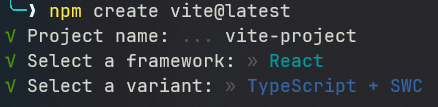
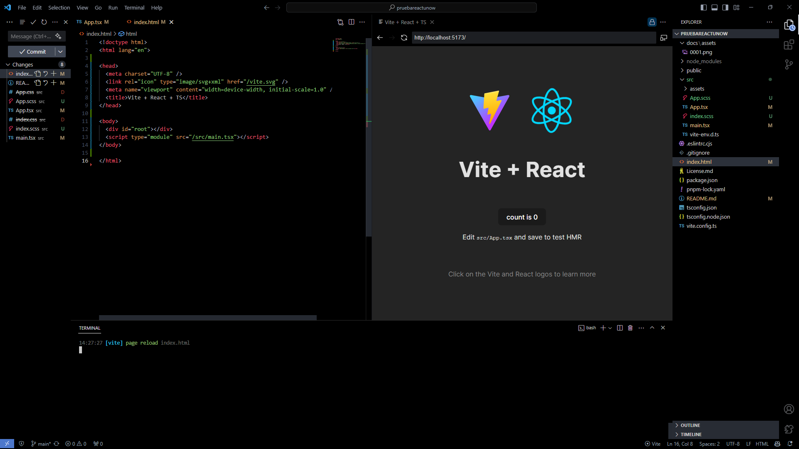

# API de usuarios de GitHub

- [API de usuarios de GitHub](#api-de-usuarios-de-github)
  - [Instalación](#instalación)
    - [Comprobar versiones](#comprobar-versiones)
    - [Creación de app con framework React](#creación-de-app-con-framework-react)
    - [Instalación de dependencias](#instalación-de-dependencias)
  - [RRRR](#rrrr)
    - [Requerimientos](#requerimientos)
    - [Recursos](#recursos)
    - [Razonar](#razonar)
    - [Respuestas](#respuestas)
  - [¿Por qué usar Vite?](#por-qué-usar-vite)
    - [Configuración de Linting en `tsconfig.json`](#configuración-de-linting-en-tsconfigjson)
    - [Uso del Plugin de React en Vite](#uso-del-plugin-de-react-en-vite)
  - [Pasos](#pasos)
    - [Acerca del SCSS](#acerca-del-scss)
  - [Entregables](#entregables)

## Instalación

### Comprobar versiones

Para comprobar la versión de Node.js y npm, abra la línea de comandos y ejecute `node -v && npm -v`. Esto verificará que tiene las versiones correctas de Node.js y npm. Si no está en la versión LTS (Long Term Support), use `nvm install 20` para obtener la versión 20.10.0.

### Creación de app con framework React

A la hora de instalar y configurar Vite para React, utilice `npm create vite@latest` seguido de `pruebareactunow` para crear un nuevo proyecto de React con Vite. Luego, navegue al directorio del proyecto con `cd pruebareactunow`.


- Se hace con React
- React está deprecado por el propio equipo de React, pero se puede usar de forma segura a través de `npm create vite@latest` y seleccionando React.
- Al no mencionar si JavaScript o TypeScript, se hace con TypeScript
- Se crea la branch ` git checkout -b "miguelgargallo"`` y se hace un commit con el nombre de la branch  `.
- Se crea el repositorio en GitHub con el nombre `pruebareactunow`..
  Por motivos de privacidad, y no mostrar mi progreso, se crea el repositorio en local y luego se copia todo en el repositorio de GitHub que toca. No hay problema en dar permisos a este una vez terminado la prueba.

### Instalación de dependencias

Opcionalmente, puede instalar pnpm, en este caso se hará globalmente con `npm install -g pnpm`. Luego, en el directorio del proyecto, ejecute `pnpm install` para instalar las dependencias del proyecto.

```bash
node -v && npm -v
```

Debemos estar en la LTS, sino es así, nvm install 20, y tendremos la 20.10.0 a fecha de semana 3 de Diciembre de 2023.

Procedemos a instalar R

```bash
npm create vite@latest
pruebareactunow
cd pruebareactunow
npm install -g pnpm
pnpm install
pnpm add sass
```

(Porque pnpm)[https://pnpm.io/pnpm-vs-npm]

## RRRR

### Requerimientos

Crear una aplicación React para obtener y mostrar una lista de usuarios de GitHub, incluyendo detalles como el nombre de usuario, ID, y más. Incorporar validadores de entrada, un gráfico de barras para mostrar seguidores y un sistema para gestionar errores.

### Recursos

Usar CSS Grid/Flexbox para el diseño, librerías de iconos como Font Awesome o Glyphicons, y cualquier librería de gráficos para el gráfico de barras.

### Razonar

La aplicación debe mostrar eficientemente los datos de los usuarios de GitHub, manejar la entrada de datos correctamente y presentar la información de manera clara y atractiva.

### Respuestas

La aplicación final debe cumplir con los requisitos funcionales especificados, ser eficiente en términos de código y algoritmos, y reflejar la creatividad y las buenas prácticas de programación.

## ¿Por qué usar Vite?

Vite se utiliza por su eficiencia en el desarrollo y la producción. Ofrece un servidor de desarrollo ultrarrápido gracias a su enfoque en el módulo nativo de ES y una construcción de producción optimizada. Además, Vite incluye configuraciones de linting avanzadas en su `tsconfig.json` que mejoran la calidad del código y ayudan a evitar errores comunes.

### Configuración de Linting en `tsconfig.json`

Se configura el linter para garantizar la calidad del código. Las opciones clave incluyen:

- `strict`: Habilita todas las opciones estrictas de tipo.
- `noUnusedLocals` y `noUnusedParameters`: Ayudan a mantener el código limpio y libre de variables y parámetros no utilizados.
- `noFallthroughCasesInSwitch`: Previene casos no intencionados en declaraciones de switch.

### Uso del Plugin de React en Vite

Para integrar React en Vite, se utiliza el plugin `@vitejs/plugin-react-swc`. Este plugin facilita el desarrollo con React y mejora el rendimiento.

```ts
import { defineConfig } from 'vite'
import react from '@vitejs/plugin-react-swc'

// https://vitejs.dev/config/
export default defineConfig({
  plugins: [react()],
})
```

Este enfoque proporciona una experiencia de desarrollo más fluida y rápida, ideal para proyectos con limitaciones de tiempo.

## Pasos

La idea es reutilizar código del setup del proyecto.


Limpiamos un poco los scss, y el punto de entrada un poco también. Y mas adelante, SEO con server side rendering.

De este modo reutilizamos partes y limpiamos el código.

```tsx
import './App.scss'

function App() {
  return (
    <>
      <main>
        <h1>Miguel Gargallo - Unow</h1>
      </main>
    </>
  )
}

export default App
```

Comenzamos con pensar la aplicación y la semántica del html, voy a imaginarme como voy a crear la aplicación.

Para planificar la aplicación, considere la estructura y la semántica del HTML teniendo en cuenta los requerimientos del ejercicio. Algunos puntos clave a tener en cuenta son:

Campo de Entrada y Botón: Necesitará un formulario con un campo de entrada para buscar usuarios y un botón para enviar la búsqueda.

Listado de Usuarios: Una sección para mostrar los resultados de la búsqueda, idealmente utilizando tarjetas o una lista para cada usuario con su nombre de usuario e ID.

Enlaces a Perfiles de Usuario: Cada usuario listado deberá ser un enlace que lleve a una ruta con el 'user.login' como parámetro.

Componente de Detalles del Usuario: Crear un componente para mostrar detalles de un usuario específico, incluyendo su imagen y otra información elegida.

Validadores: Añadir validaciones para la entrada del usuario, asegurando un mínimo de 4 caracteres y restringiendo la búsqueda de ciertas palabras.

Gráfico de Barras: Incorporar un gráfico de barras para mostrar el número de seguidores de los usuarios.

Gestión de Errores: Implementar un sistema para mostrar mensajes de error en la aplicación.

### Acerca del SCSS

He optimizado los archivos SCSS en los archivos, App e Index en formato SCSS, para que sea más fácil de leer y mantener. Usando los archivos de variables para los colores y fuentes, y un archivo de mixins para los estilos reutilizables.

## Entregables

- [x] Crear una aplicación que incluya un campo de entrada texto y un botón, para que se pueda capturar el usuario y recuperar la información utilizando el API anteriormente indicada. [./src/App.tsx](./src/App.tsx)
- [x] Mostrar los primeros 10 usuarios del resultado de la búsqueda, incluyendo su nombre de usuario ('user.login') y el id ('user.id') de cada registro. [./src/ui/Form.tsx](./src/ui/Form.tsx)
- [x] Convertir cada Perfil de usuario en un enlace, para que al hacer clic en cada registro, navegue a una ruta que incluya la propiedad 'user.login' como parámetro. [./src/ui/Form.tsx](./src/ui/Form.tsx)
- [x] Crear un componente independiente en el que se lea el parámetro de la URL, y a continuación, obtenga los datos de dicho usuario mediante la siguiente API: https://api.github.com/users/YOUR_NAME [./src/ui/Form.tsx](./src/ui/Form.tsx) y [./src/ui/UserDetail.tsx](./src/ui/UserDetail.tsx)
- [x] Incluir la imagen del usuario ('avatar_url') y alguna otra información (de su elección) en el componente. [./src/ui/UserDetail.tsx](./src/ui/UserDetail.tsx)
- [x] Incluir un validador que verifique que el texto de búsqueda de usuarios sea de un mínimo de 4 caracteres, y otro que NO permita realizar la búsqueda de la palabra “iseijasunow”. [./src/ui/Form.tsx](./src/ui/Form.tsx)
- [x] Integrar cualquier librería de gráficos que pueda encontrar y crear un gráfico de barras simple para mostrar el número de seguidores de los 10 primeros usuarios. [./src/ui/Form.tsx](./src/ui/Form.tsx)
- [x] Incluir un componente para mostrar mensajes de Errores Generales en toda la aplicación. [./src/ui/Toast.tsx](./src/ui/Toast.tsx)
- [x] CSS: Utilizar CSS Grid y/o CSS Flexbox, para la maquetación del proyecto [./src/App.scss](./src/App.scss) y [./src/index.scss](./src/index.scss)
- [x] Iconos: Utilizar una librería para el manejo de iconos Tabler Icons es algo que he propuesto como aportación personal. [./src/ui/Form.tsx](./src/ui/Form.tsx) y [./src/ui/UserDetail.tsx](./src/ui/UserDetail.tsx)
